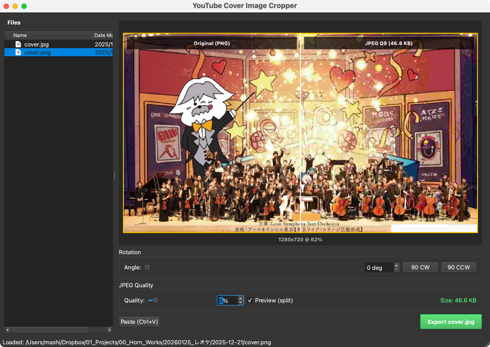

# YouTube Cover Image Cropper

YouTube動画のカバー画像（サムネイル）を16:9比率で切り出し、1280x720のJPEGとして書き出すデスクトップアプリケーションです。

## Features

- **16:9アスペクト比でのクロップ**: ドラッグで移動、コーナーでリサイズ
- **回転調整**: 0-359度の回転に対応
- **品質調整**: JPEGの圧縮品質をリアルタイムで調整
- **ドットバイドットプレビュー**: 実寸（1280x720）での品質比較表示
- **クリップボード対応**: Ctrl+Vで画像を貼り付け
- **ファイルブラウザ**: 左パネルで画像ファイルを簡単に選択

## Screenshot



## Requirements

- Python 3.10+
- PySide6

## Installation

```bash
# Clone the repository
git clone https://github.com/YOUR_USERNAME/youtube-cover-cropper.git
cd youtube-cover-cropper

# Install dependencies
pip install -r requirements.txt
```

## Usage

```bash
# Basic usage
python main.py

# Start with a specific directory
python main.py /path/to/your/images
```

### Controls

| Operation | Action |
|-----------|--------|
| ダブルクリック | 画像を読み込み |
| ドラッグ | クロップ範囲を移動 |
| コーナードラッグ | クロップ範囲をリサイズ |
| Ctrl+V | クリップボードから貼り付け |
| 回転スライダー | 画像を回転 |
| 品質スライダー | JPEG品質を調整 |
| Preview (split) | 実寸プレビュー表示 |

## Output

- **サイズ**: 1280 x 720 pixels
- **フォーマット**: JPEG
- **品質**: 1-100（調整可能、デフォルト85）

## License

MIT License
